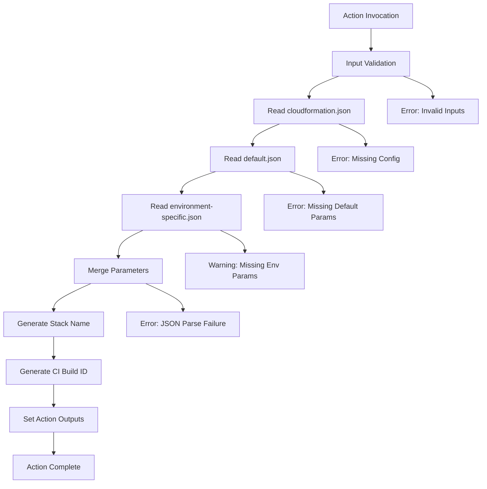

# Design Document

## Overview

This GitHub reusable action will be implemented as a JavaScript-based composite action that processes CloudFormation deployment configurations. The action will read configuration files from a specified directory structure, merge parameter files with environment-specific overrides, and generate three key outputs for CloudFormation deployment pipelines: formatted parameter arrays, dynamically generated stack names, and CI build identifiers.

The action follows GitHub Actions best practices by using the composite action approach with JavaScript execution, providing clear input/output interfaces, and implementing robust error handling throughout the processing pipeline.

## Architecture

### High-Level Flow



### Directory Structure Expected

```
{folder}/
├── cloudformation.json          # Main configuration
└── params/
    ├── default.json            # Default parameters
    ├── sb-devl-us-east-1.json  # Environment-specific params
    ├── sb-test-us-east-1.json  # Environment-specific params
    └── sb-prod-us-east-1.json  # Environment-specific params
```

## Components and Interfaces

### Action Definition (action.yaml)

**Inputs:**
- `folder`: String, default "cfn", specifies the configuration folder path
- `ci-build`: Boolean, determines if this is a CI build or environment deployment
- `environment`: String, specifies the target environment name

**Outputs:**
- `parameters`: JSON string array of CloudFormation parameters
- `stack-name`: String, formatted stack name for deployment
- `ci-build-id`: String, random identifier for CI builds or empty string

### Core JavaScript Modules

#### 1. ConfigurationReader Module
```javascript
class ConfigurationReader {
  async readCloudFormationConfig(folderPath)
  async readDefaultParameters(folderPath)
  async readEnvironmentParameters(folderPath, environment)
  validateJsonStructure(data, requiredFields)
}
```

**Responsibilities:**
- Read and validate cloudformation.json structure
- Load parameter files with error handling
- Validate JSON format and required fields

#### 2. ParameterMerger Module
```javascript
class ParameterMerger {
  mergeParameters(defaultParams, envParams)
  formatForCloudFormation(mergedParams)
}
```

**Responsibilities:**
- Merge default and environment-specific parameters
- Convert to CloudFormation parameter array format
- Handle parameter precedence (environment overrides default)

#### 3. StackNameGenerator Module
```javascript
class StackNameGenerator {
  async generateStackName(project, stackPrefix, isCiBuild, environment)
  async getCurrentBranchName()
  sanitizeBranchName(branchName)
}
```

**Responsibilities:**
- Generate appropriate stack names based on build type
- Extract current Git branch for CI builds
- Sanitize branch names for CloudFormation compatibility

#### 4. CiBuildIdGenerator Module
```javascript
class CiBuildIdGenerator {
  generateRandomId(length = 8)
  validateIdFormat(id)
}
```

**Responsibilities:**
- Generate random lowercase alphabetic strings
- Ensure uniqueness and proper format

### Main Action Entry Point

```javascript
// main.js
async function run() {
  try {
    // Input processing
    // Configuration reading
    // Parameter merging
    // Output generation
    // Action output setting
  } catch (error) {
    // Error handling and action failure
  }
}
```

## Data Models

### CloudFormation Configuration Schema
```json
{
  "project": "string (required)",
  "template": "string (required)", 
  "stack-prefix": "string (required)"
}
```

### Parameter File Schema
```json
{
  "ParameterName1": "string",
  "ParameterName2": "string",
  "...": "..."
}
```

### CloudFormation Parameter Output Format
```json
[
  {
    "ParameterName": "ParameterName1",
    "ParameterValue": "ParamValue1"
  },
  {
    "ParameterName": "ParameterName2", 
    "ParameterValue": "ParamValue2"
  }
]
```

## Error Handling

### Error Categories and Responses

1. **Input Validation Errors**
   - Missing required folder
   - Invalid boolean values for ci-build
   - Empty environment name when ci-build is false

2. **File System Errors**
   - Missing cloudformation.json file
   - Missing default.json file
   - Inaccessible folder permissions

3. **JSON Parsing Errors**
   - Malformed JSON in configuration files
   - Missing required fields in cloudformation.json
   - Invalid parameter file structure

4. **Git Operation Errors**
   - Unable to determine current branch (CI build mode)
   - Git repository not initialized

### Error Handling Strategy

- **Fail Fast**: Immediately exit on critical errors (missing config files, invalid JSON)
- **Graceful Degradation**: Continue with warnings for non-critical issues (missing environment-specific parameters)
- **Clear Error Messages**: Provide actionable error messages with context
- **Proper Exit Codes**: Use appropriate exit codes for different error types

## Testing Strategy

### Unit Testing Approach

1. **Configuration Reader Tests**
   - Valid configuration file parsing
   - Error handling for missing/invalid files
   - JSON validation edge cases

2. **Parameter Merger Tests**
   - Default parameter processing
   - Environment override behavior
   - CloudFormation format conversion
   - Edge cases (empty files, conflicting keys)

3. **Stack Name Generator Tests**
   - CI build name generation
   - Environment-based name generation
   - Branch name sanitization
   - Git operation error handling

4. **CI Build ID Generator Tests**
   - Random string generation
   - Format validation
   - Uniqueness verification

### Integration Testing

1. **End-to-End Scenarios**
   - Complete action execution with valid inputs
   - Various folder structures and configurations
   - Different environment and CI build combinations

2. **Error Path Testing**
   - Missing file scenarios
   - Invalid JSON scenarios
   - Git repository edge cases

### Test Data Structure

```
test/
├── fixtures/
│   ├── valid-config/
│   │   ├── cloudformation.json
│   │   └── params/
│   │       ├── default.json
│   │       └── sb-devl-us-east-1.json
│   ├── invalid-config/
│   └── missing-files/
├── unit/
│   ├── configuration-reader.test.js
│   ├── parameter-merger.test.js
│   ├── stack-name-generator.test.js
│   └── ci-build-id-generator.test.js
└── integration/
    └── action.test.js
```

## Implementation Considerations

### Performance Optimizations
- Asynchronous file operations to prevent blocking
- Minimal memory footprint for parameter processing
- Efficient JSON parsing and validation

### Security Considerations
- Input sanitization for file paths
- Validation of JSON content to prevent injection
- Secure handling of environment variables and tokens

### Maintainability Features
- Modular architecture for easy testing and updates
- Clear separation of concerns between components
- Comprehensive error logging and debugging information
- TypeScript-style JSDoc comments for better IDE support